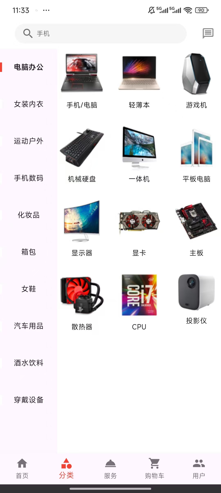
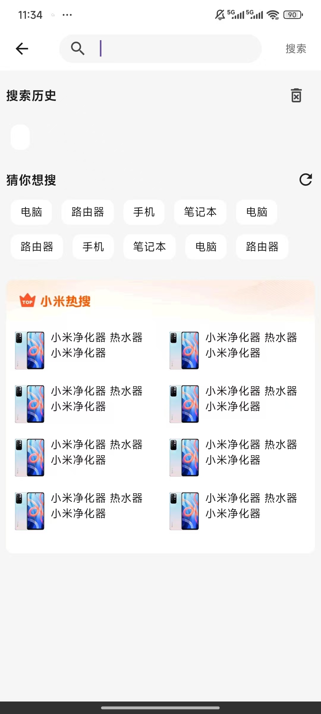
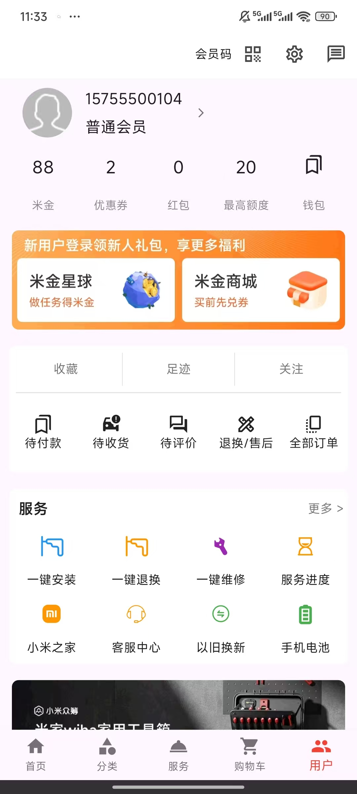

# XMShop - 基于小米商城的Flutter项目

[](https://flutter.dev/)
[](https://dart.dev/)
[](https://github.com/YouRen-Li/xmshop)
[](LICENSE)

一个基于小米商城UI设计的Flutter学习项目，参考了小米商城的界面风格，实现了商品浏览、购物车、用户登录等基础电商功能，适合Flutter初学者学习和参考。

## 🎯 项目特色

- 🎨 **UI还原**：参考小米商城的界面设计风格
- 📱 **跨平台**：基于Flutter框架支持多端运行
- 🏗️ **规范架构**：采用GetX状态管理，模块化开发
- 💻 **学习项目**：适合Flutter初学者学习电商App开发
- 🛠️ **基础功能**：实现了部分电商应用的基础功能

## ✨ 已实现功能

### 🏠 首页展示
- 商品轮播图展示
- 热门商品推荐
- 分类快捷入口

### 🔍 商品浏览
- 商品分类页面
- 商品列表展示
- 商品详情查看
- 商品搜索功能
- 价格排序筛选

### 🛒 购物车功能
- 添加商品到购物车
- 购物车数量增减
- 商品选择/取消选择
- 价格自动计算

### 🔐 用户认证
- 手机号登录
- 短信验证码登录
- 用户注册功能

### 📦 订单功能
- 商品结算页面
- 收货地址选择
- 基础下单功能

### 👤 个人中心
- 用户信息展示
- 基础设置页面

> **注意**: 这是一个学习项目，部分功能为演示版本，不包含完整的后端服务和支付功能。

## 🛠️ 技术栈

- **前端框架**: Flutter 3.0+
- **编程语言**: Dart 2.17+
- **状态管理**: GetX
- **路由管理**: GetX Navigation
- **网络请求**: HTTP
- **本地存储**: SharedPreferences
- **图标字体**: 自定义IconFont

## 📱 支持平台

- ✅ Android
- ✅ iOS
- ✅ Web
- ✅ macOS
- ✅ Windows
- ✅ Linux

## 🚀 快速开始

### 环境要求

- Flutter SDK >= 3.0.0
- Dart SDK >= 2.17.0
- Android Studio / VS Code
- Android SDK (Android开发)
- Xcode (iOS开发)

### 安装步骤

1. **克隆项目**
   ```bash
   git clone https://github.com/YouRen-Li/xmshop.git
   cd xmshop
   ```

2. **安装依赖**
   ```bash
   flutter pub get
   ```

3. **运行项目**
   ```bash
   # Android
   flutter run

   # iOS
   flutter run -d ios

   # Web
   flutter run -d chrome

   # 指定设备
   flutter devices
   flutter run -d <device_id>
   ```

### 构建发布版本

```bash
# Android APK
flutter build apk --release

# Android App Bundle
flutter build appbundle --release

# iOS
flutter build ios --release

# Web
flutter build web --release
```

## 📁 项目结构

```
lib/
├── app/
│   ├── models/           # 数据模型
│   │   ├── address_model.dart
│   │   ├── category_model.dart
│   │   ├── focus_model.dart
│   │   └── ...
│   ├── modules/          # 功能模块
│   │   ├── address/      # 地址管理
│   │   ├── cart/         # 购物车
│   │   ├── category/     # 商品分类
│   │   ├── checkout/     # 结算
│   │   ├── home/         # 首页
│   │   ├── order/        # 订单
│   │   ├── pass/         # 登录注册
│   │   ├── pay/          # 支付
│   │   ├── productContent/ # 商品详情
│   │   ├── productList/  # 商品列表
│   │   ├── search/       # 搜索
│   │   ├── tabs/         # 底部导航
│   │   └── user/         # 用户中心
│   ├── routes/           # 路由配置
│   │   ├── app_pages.dart
│   │   └── app_routes.dart
│   ├── services/         # 服务层
│   │   ├── cartServices.dart
│   │   ├── httpsClient.dart
│   │   └── ...
│   └── widget/           # 公共组件
│       ├── logo.dart
│       ├── passButton.dart
│       └── ...
├── main.dart             # 应用入口
└── ...
assets/
├── fonts/               # 字体文件
├── images/              # 图片资源
└── ...
```

## 🎨 界面预览

### 📱 主要功能界面

<div align="center">

| 首页 | 分类 |
|:---:|:---:|
|  |  |

| 搜索 | 用户中心 |
|:---:|:---:|
|  |  |

</div>

### 📝 界面说明
- **首页**: 展示商品轮播图、推荐商品、分类入口
- **分类**: 商品分类浏览、基础筛选功能
- **搜索**: 商品搜索界面、搜索结果展示
- **用户中心**: 个人信息展示、基础功能页面

## 🔧 开发指南

### 代码规范

- 遵循Dart官方代码规范
- 使用GetX进行状态管理和路由管理
- 采用MVC架构模式
- 组件化开发，提高代码复用性

### 添加新功能

1. 在`lib/app/modules/`下创建新的功能模块
2. 按照GetX规范创建Controller、View和Binding
3. 在`app_pages.dart`中添加路由配置
4. 在`app_routes.dart`中定义路由常量

### API集成

API服务配置在`lib/app/services/httpsClient.dart`中，支持：
- 请求拦截器
- 响应拦截器
- 错误处理
- 统一的请求格式

## 📈 性能优化

- 使用GetX进行高效的状态管理
- 图片懒加载和缓存
- 列表虚拟化渲染
- 代码分割和懒加载

## 🤝 贡献指南

欢迎贡献代码！请遵循以下步骤：

1. Fork 项目
2. 创建功能分支 (`git checkout -b feature/AmazingFeature`)
3. 提交更改 (`git commit -m 'Add some AmazingFeature'`)
4. 推送到分支 (`git push origin feature/AmazingFeature`)
5. 开启 Pull Request

## 📄 许可证

本项目采用 MIT 许可证。详情请见 [LICENSE](LICENSE) 文件。

## 📞 联系方式

- 作者：YouRen-Li
- 项目地址：[https://github.com/YouRen-Li/xmshop](https://github.com/YouRen-Li/xmshop)
- 原项目参考：小米商城官方设计

## 🙏 致谢

- 感谢小米官方提供的优秀UI设计参考
- 感谢Flutter团队提供的强大跨平台框架
- 感谢GetX库作者提供的高效状态管理解决方案
- 感谢所有为此项目做出贡献的开发者！

---

⭐ 如果这个项目对你有帮助，请给它一个星标！
